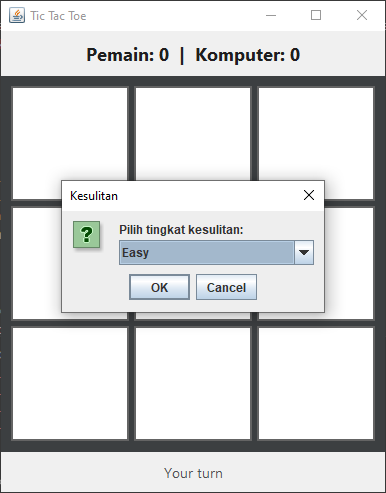
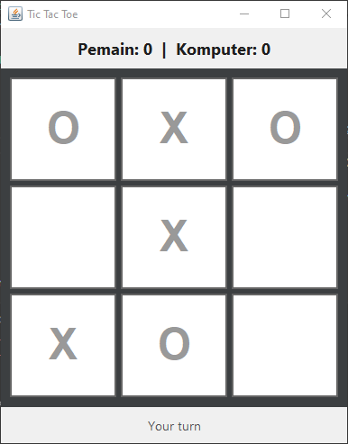

# 🎮 Tic Tac Toe GUI - Java Swing

Sebuah game Tic Tac Toe (X/O) dengan GUI berbasis Java Swing.  
Menyediakan papan permainan 3×3 dengan mode melawan komputer dengan beberapa tingkat kesulitan, serta tampilan modern dengan skor yang selalu terupdate.

---

## ✨ Fitur
- ✅ Papan Tic Tac Toe 3×3 dengan tampilan bersih
- ✅ Pemain vs Komputer
- ✅ Pilihan tingkat kesulitan: Easy / Normal / Hard
- ✅ Skor pemain & komputer ditampilkan & terupdate otomatis
- ✅ Restart game kapan saja
- ✅ Desain tombol modern & (opsional) rounded corner

---

## 📸 Screenshot



---

## 🚀 Cara Menjalankan
### Persyaratan:
- Java JDK 8+  
- IDE atau editor favorit (misalnya: IntelliJ IDEA, NetBeans, VSCode)

### Jalankan dari IDE:
1️⃣ Clone repo ini atau unduh ZIP  
2️⃣ Buka folder project di IDE  
3️⃣ Jalankan file src/Main.java

### Jalankan dari terminal:
```bash
javac -d out src/game/GUI/*.java src/game/*.java src/Main.java
java -cp out Main
```

---

## 🛠️ Struktur Folder
```
src/
├── game/
    ├── Game.java
    ├── Computer.java
    └── GUI/
        ├── Board.java
        └── Frame.java
└── Main.java
docs/
└── screenshot.png
.gitignore
README.md
```

---

## 🎨 Teknologi
- Java 8+
- Swing (JButton, JPanel, JFrame, JOptionPane, dll)

---

## 📜 Lisensi
MIT License — bebas digunakan & dikembangkan.

---

## ❤️ Kontribusi
Jika ingin berkontribusi (misalnya: menambahkan animasi, AI lebih pintar, atau mode multiplayer), jangan ragu untuk kirim PR!

---

### Author
🧑‍💻 Dibuat dengan semangat belajar Java oleh Muhammad Farhan.
